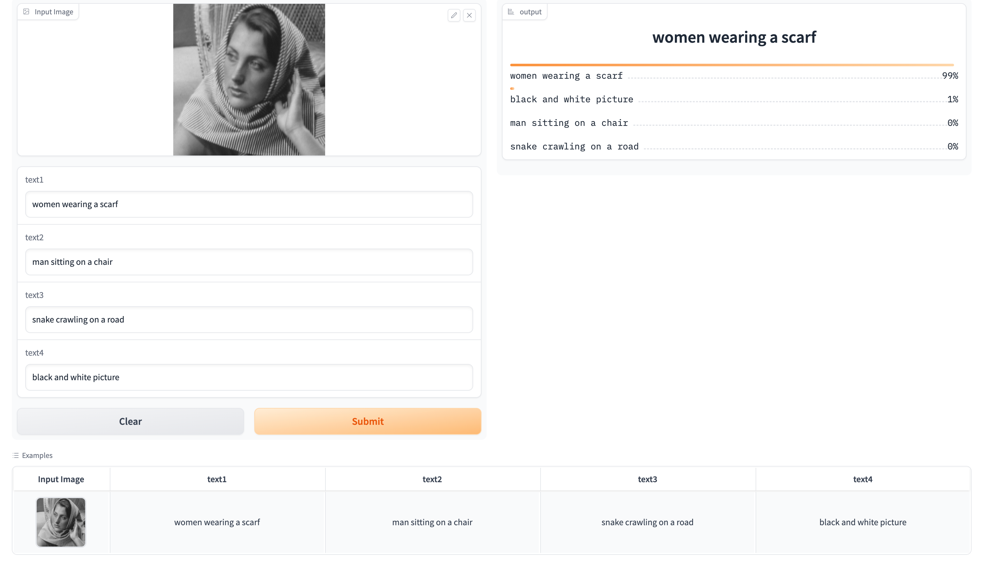

# ERA1 Session19

This reposity contains the source files [app.py][def3] that could be hosted on "Gradio" space.
The base CLIP model has been taken from [CLIP][def]

[def3]: app.py
[def]: https://huggingface.co/openai/clip-vit-base-patch32

Huggingface space - Gradio: [CLIP_classifierByPrompts][def2]

[def2]: https://huggingface.co/spaces/shreyash99/CLIP_classifierByPrompts

Working example:
